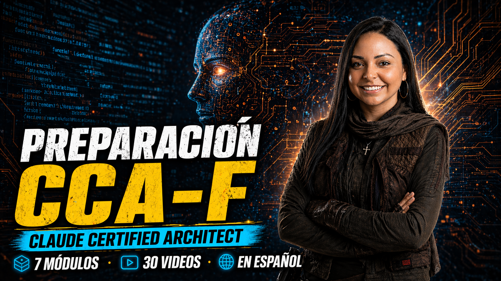

# Claude Certified Architect: De Spider-Man a Star Wars



> La guía completa para el **Claude Certified Architect – Foundations (CCA-F)** — Domina Arquitectura Agéntica, Diseño de Herramientas, Claude Code, Prompt Engineering y Context Management con Universos Pop Culture.  
> 7 módulos · 34 videos · 6 dominios del examen · Universos temáticos por módulo

**El blog detallado con toda la teoría del curso está en:** [ivanatilca.com — Claude Certified Architect: De Spider-Man a Star Wars](https://www.ivanatilca.com/training/claude-certified-architect-exam-prep-from-spider-man-to-star-wars)

---

## ¿Este training es para ti?

Este curso está dirigido a desarrolladores, arquitectos de software y profesionales de IA que quieren obtener la certificación **Claude Certified Architect – Foundations (CCA-F)**. Es ideal si estás construyendo o planeas construir aplicaciones con Claude, si trabajás con sistemas agénticos, prompt engineering o gestión de contexto, o si querés un repaso estructurado y orientado al examen de los 5 dominios del CCA-F.

No se requiere experiencia previa en certificaciones, pero se recomienda familiaridad básica con Python y APIs. Si aprendés mejor a través de historias y analogías inesperadas — Spider-Man explicando sub-agentes, Star Wars explicando el context window, Batman depurando prompts — **este curso fue hecho para ti**.

---

## Instructores

### Ivana Tilca — Technology Advocate
Technology Advocate con más de 10 años en el rubro y Microsoft MVP en AI. Inició su camino en Salta y su carrera la llevó a Estados Unidos y Buenos Aires, donde trabajó para Microsoft. Capacita a equipos a nivel global como conferencista y creadora de contenido.

### Fernando Sonego — Manager of Architecture
Arquitecto de software y estratega de innovación en Buenos Aires. Gerente en Banco Hipotecario y Microsoft MVP (Developer Technologies). Especialista en sistemas distribuidos, Cloud Computing y metodologías ágiles (Scrum/MOF).

### Pablo Di Loreto — Engineering Director
Engineering Manager en MODO, la solución de pagos que está simplificando la vida cotidiana en Argentina. Analista de Sistemas, Profesor y líder de iniciativas de impacto: AprenderIT, PuertoTec y ConoSurTech. Apasionado por el software, la gestión de servidores y el conocimiento compartido.

---

## ¿Qué es la certificación CCA-F?

La CCA-F es la certificación técnica oficial de Anthropic para el ecosistema Claude. Evalúa competencias en arquitecturas agentivas, tool use, Claude Code en producción, prompt engineering, gestión de contexto e IA responsable. Este repositorio contiene **todo el código** que se presenta en los videos del curso.

---

## Mapa del Curso

| Módulo | Tema | Universos usados | Dominio Principal |
|--------|------|-----------------|-------------------|
| M0 | Fundamentos y contexto CCA-F | Spider-Man (Jameson) | — |
| M1 | Agentic Architecture | Sommelier · Harry Potter · Star Wars · M3GAN · Deadpool · X-Men · Skynet | D1 (27%) |
| M2 | Claude Code — Fundamentos | Batman / DC | D3 (20%) |
| M3 | Claude Code — Avanzado y CI/CD | M3gan | D2 (22%) |
| M4 | Prompt Engineering | Los Vengadores | D4 (20%) |
| M5 | Tool Use — Conceptual y Contexto | Matrix | D1+D2 (22%) |
| M6 | Tool Use — Diseño Técnico | Spider-Man | D1+D2 (27%) |

---

## Dominios del Examen CCA-F

| Dominio | Nombre | Peso |
|---------|--------|------|
| D1 | Agentic Architecture | 27% |
| D2 | Tool Use & Claude Code | 22% |
| D3 | Claude Code | 20% |
| D4 | Prompt Engineering | 20% |
| D5 | Context Management | 11% |
| D6 | Responsible AI | 5% |

---

## Estructura del Repositorio

```
ccaf-exam-prep/
├── README.md
├── .gitignore
│
├── M0_Fundamentos/
│   ├── README.md
│   ├── ejercicio-video2-ej1.py   ← system prompt: J. Jonah Jameson (titulares sesgados)
│   └── ejercicio-video2-ej2.py   ← multi-agente: Jameson (Haiku) + analista de medios (Sonnet)
│
├── M1_Agentic_Architecture/
│   ├── README.md
│   ├── ejercicio-video1.py       ← agentic loop: sommelier conversacional con while loop
│   ├── ejercicio-video2.py       ← pipeline multi-agente: Hermione · Ron · Dumbledore
│   ├── ejercicio-video3.py       ← session state: planificador + ejecutor (Star Wars)
│   ├── ejercicio-video4.py       ← tool use con hooks pre/post/error (M3GAN)
│   ├── ejercicio-video5.py       ← HITL · guardrails · audit trail (Deadpool / Colossus)
│   ├── ejercicio-video6.py       ← external memory · episodic memory · windowing (X-Men)
│   └── ejercicio-video7.py       ← prompt injection · adversarial robustness (Skynet)
│
├── M2_ClaudeCode_Basico/
│   ├── README.md
│   ├── ejercicio-video1.py         ← tool design: 3 tools bien diseñadas (Batman / GCPD)
│   ├── ejercicio-video2-r2d2.py    ← servidor MCP: las 3 primitivas — Tool, Resource, Prompt (Star Wars)
│   ├── ejercicio-video2-cliente.py ← cliente MCP: conecta al servidor R2D2 vía stdio
│   ├── ejercicio-video3.py         ← servidor MCP con transporte stdio (The Mandalorian)
│   ├── ejercicio-video4.py         ← principio de menor privilegio: Oracle + Robin + Batman
│   └── ejercicio-video5.py         ← error handling: 3 tipos de errores (JARVIS / Vengadores)
│
├── M3_ClaudeCode_Avanzado/
│   ├── README.md
│   ├── ejercicio-video1/
│   │   ├── project-inicial/      ← CLAUDE.md mínimo + Flask API (Rebel Alliance)
│   │   └── project-final/        ← CLAUDE.md completo con convenciones y notas
│   ├── ejercicio-video2/
│   │   ├── settings.json         ← allow/deny list de permisos
│   │   └── hooks/
│   │       ├── spider_sense.py   ← PreToolUse: bloquea rutas y comandos peligrosos
│   │       └── audit_logger.py   ← PostToolUse: registra cada acción en audit.log
│   └── ejercicio-video3/
│       ├── seed_db.py            ← recrea la DB con misiones, agentes y recursos
│       └── Puntoclaude/          ← estructura .claude/ del proyecto
│           ├── settings.json     ← permisos MCP + hooks
│           ├── settings.local.json ← activación local de MCP servers (no commitear)
│           ├── hooks/            ← spider_sense.py + audit_logger.py
│           └── mcp/
│               ├── db_server.py      ← rebel-db (stdio): list_tables, query, execute
│               └── github_server.py  ← rebel-github (HTTP): issues, files, PRs
│
├── M4_Prompt_Engineering/
│   └── README.md                 ← código próximamente
│
├── M5_Tool_Use_Conceptual/
│   └── README.md                 ← código próximamente
│
└── M6_Tool_Use_Tecnico/
    └── README.md                 ← código próximamente
```

---

## Requisitos

```bash
pip install anthropic
```

Todos los ejemplos usan el SDK oficial de Anthropic para Python. Necesitás una API key:

```bash
export ANTHROPIC_API_KEY="sk-ant-..."
```

---

## Cómo usar este repositorio

Cada carpeta de módulo tiene su propio `README.md` con:
- El tema del módulo y los videos que cubre
- Los conceptos CCA-F que se trabajan en el código
- Instrucciones de ejecución para cada archivo

Los archivos de código están ordenados para seguirse en paralelo con los videos del curso. No es necesario ejecutarlos para entender el contenido — pero sí ayuda.

---

## Videos del Curso

| # | Video ID | Título |
|---|----------|--------|
| 01 | M0V1 | [Introducción al Ecosistema Claude y la Certificación CCA-F](https://www.youtube.com/watch?v=lY-7IhBqx4s&t=1s) |
| 02 | M0V2 | [Modelos Claude: Opus, Sonnet y Haiku — Cuándo Usar Cada Uno](https://www.youtube.com/watch?v=CkgZc4FsHjg&t=7s) |
| 03 | M1V1 | [Qué es un Agente y el Agentic Loop](https://www.youtube.com/watch?v=gNCBdj2sMZg&t=6s) |
| 04 | M1V2 | [El Context Window: Límites, Estrategias y Gestión](https://www.youtube.com/watch?v=4LAOl-k8s7E) |
| 05 | M1V3 | [Tool Use en Profundidad](https://www.youtube.com/watch?v=I-Hngi5PTeM&t=4s) |
| 06 | M1V4 | [Criterios de parada, seguridad agéntica y human-in-the-loop](https://www.youtube.com/watch?v=NlBUKPWUpJM) |
| 07 | M1V5 | [Estado del Agente](https://www.youtube.com/watch?v=dwahdafDNj8) |
| 08 | M1V6 | [Comunicación Multi-Agente: El Profesor X y los X-Men Como Sistema Distribuido](https://www.youtube.com/watch?v=FBOHmBeeQZs) |
| 09 | M1V7 | [Prompt Injection y Adversarial Robustness: Skynet vs. La Resistencia](https://www.youtube.com/watch?v=-JdXXnWJWKk) |
| 10 | M2V1 | [Anatomía de una Tool en Claude: cómo Claude decide qué herramienta usar](https://www.youtube.com/watch?v=Dva88yW8YLU) |
| 11 | M2V2 | [MCP (Model Context Protocol): qué es, por qué existe y las 3 primitivas](https://www.youtube.com/watch?v=_Ehgb2GYUjg) |
| 12 | M2V3 | [MCP: Transportes stdio vs HTTP, autenticación y seguridad](https://www.youtube.com/watch?v=jKvqmWTCc0I) |
| 13 | M2V4 | [Principio de Menor Privilegio en Tools: diseño seguro de herramientas](https://www.youtube.com/watch?v=SzSGv2AhJZY) |
| 14 | M2V5 | [Error Handling en Tool Use: los 3 tipos de errores y cómo manejarlos](https://www.youtube.com/watch?v=ziRlLJu9bK4) |
| 15 | M3V1 | [Claude Code: instalación, CLI y CLAUDE.md explicados](https://www.youtube.com/watch?v=aqCjLhFBwl8) |
| 16 | M3V2 | [Hooks y Sistema de Permisos en Claude Code: control total del agente](https://www.youtube.com/watch?v=_9CerbfjU8Y) |
| 17 | M3V3 | [MCP Servers en Claude Code: transportes, scopes y diagnóstico](https://www.youtube.com/watch?v=zrv_B1VIy74) |
| 18 | M3V4 | Sub-agentes con Claude Code |
| 19 | M3V5 | Claude Code en CI/CD y Flujos de Equipo |
| 20 | M4V1 | Fundamentos de Prompt Engineering para el CCA-F |
| 21 | M4V2 | Few-Shot Prompting y Ejemplos |
| 22 | M4V3 | Chain-of-Thought y Razonamiento Estructurado |
| 23 | M4V4 | Tool Use desde el Prompt: Cuándo y Cómo |
| 24 | M4V5 | Prompts para Sistemas Multi-agente |
| 25 | M5V1 | Tool Use: Conceptos Fundamentales |
| 26 | M5V2 | Tool Results y su Impacto en el Contexto |
| 27 | M5V3 | Gestión de Contexto con Tool Use |
| 28 | M5V4 | Patrones de Tool Use en Agentes |
| 29 | M5V5 | Tools como Mecanismo de Delegación |
| 30 | M6V1 | Tool Use: Diseño e Implementación Técnica |
| 31 | M6V2 | Computer Use y Herramientas Avanzadas |
| 32 | M6V3 | Tool Use en Sistemas de Producción |
| 33 | M6V4 | Patrones de Integración y Arquitecturas |
| 34 | M6V5 | Repaso Final y Simulacro CCA-F |

---

## Licencia

Uso educativo personal. El contenido del curso es propiedad de los autores.
